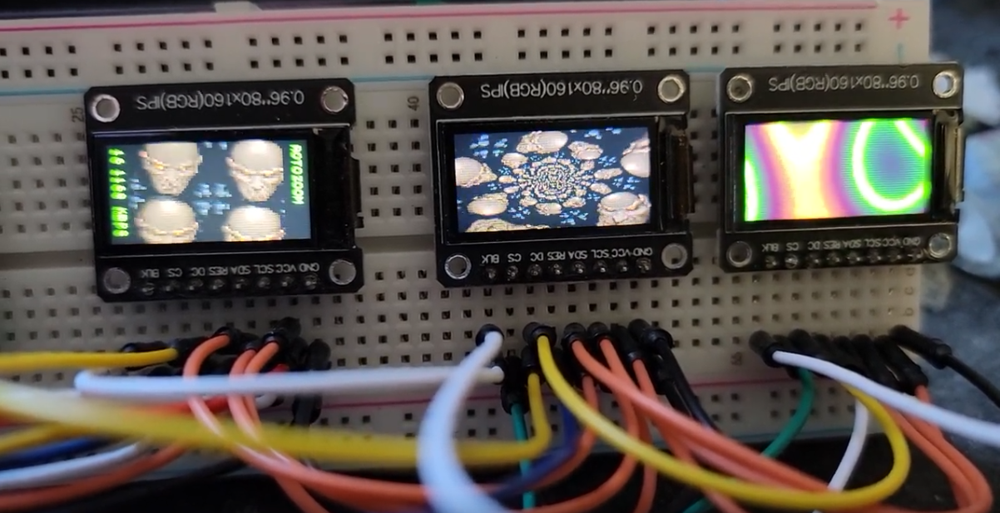

## Multiple Displays for Raspberry Pi Pico



Using a modified version of the [HAGL graphics library](https://github.com/Uberfoo-Heavy-Industries/hagl) and [HAGL Pico mipi driver](https://github.com/Uberfoo-Heavy-Industries/hagl_pico_mipi) we can attach 3 or more displays to an RP2040.

If you cannot compile yourself build directory contains a [recent firmware](https://github.com/james-bryant/pico_effects/raw/master/build/firmware.uf2).

Credit for this mostly belongs to [Mika Tuupola](https://github.com/tuupola) who is the original author of all the graphics libraries and example code. My contribution merely consists of modifying the libraries to support multiple displays.

## Compile

Below instructions assume you do not have [Raspberry Pi Pico SDK](https://github.com/raspberrypi/pico-sdk) installed yet.

```
$ git clone --recursive https://github.com/raspberrypi/pico-sdk.git
$ git clone --recursive  https://github.com/james-bryant/pico_effects
$ cd pico_effects/build
$ cmake ..
$ make -j8
```

If the SDK is already installed you can pass the installation path manually.

```
$ git clone --recursive  https://github.com/james-bryant/pico_effects
$ cd pico_effects/build
$ cmake .. -DPICO_SDK_PATH=../pico-sdk
$ make -j8
```

You can then "flash" the firmware by putting the Pico into `BOOTSEL` mode and copying the uf2 file to the automatically mounted volume.

```
$ cp firmware.uf2 /run/media/<username>/RPI-RP2/
```

If you are using macOS the command would be the following.

```
$ cp firmware.uf2 /Volumes/RPI-RP2
```

Alternatively you can use picotool to flash the firmware.

```
$ picotool load firmware.uf2 -f
```

## Hardware

The hardware used in this example is a Raspberry Pi Pico board and the three display modules.

The modules I used can be found here: https://www.aliexpress.us/item/2251832728153401.html
Similar display modules should work as long as you adjust the config parameters accordingly.

The following tables has the wiring. All three displays share a SPI port, so the SDA, SCL, and DC pins connect to all three displays.

| Pico Pin | GPIO | display1 Pin | display2 pin | display3 pin |
|----------|------|--------------|--------------|--------------|
| 18       |      | VCC          | VCC          | VCC          |
| 36       |      | GND          | GND          | GND          |
| 15       | 11   | SDA          | SDA          | SDA          |
| 14       | 10   | SCL          | SCL          | SCL          |
| 11       | 8    | DC           | DC           | DC           |
| 12       | 9    | CS           |              |              |
| 16       | 12   | RST          |              |              |
| 7        | 5    |              | CS           |              |
| 6        | 4    |              | RST          |              |
| 5        | 3    |              |              | CS           |
| 4        | 2    |              |              | RST          |

## Future

This project was merely a proof of concept for other projects I'm working on. I do not plan to develop this example project any further short of any bug fixes.

## License

MIT No Attribution (MIT-0). Please see [LICENSE](LICENSE) for more information.
